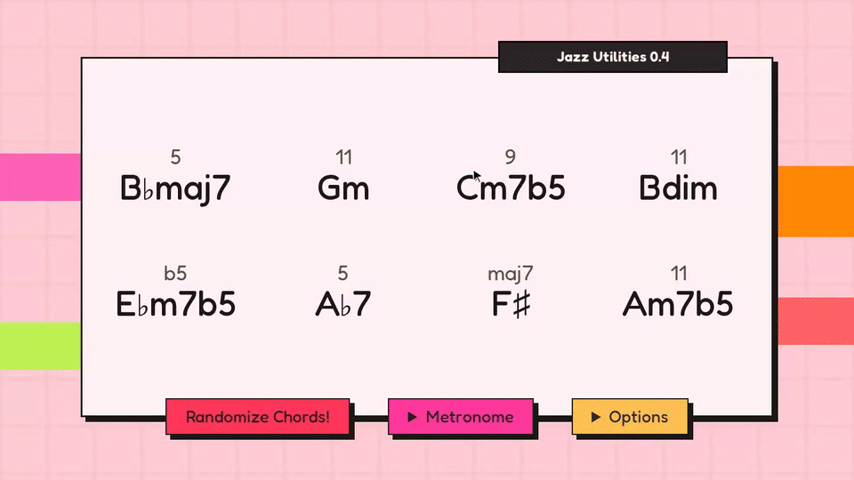

# Jazz Utilities

A practice tool for jazz musicians. Generate random chords (with or without a harmonically correct guide tone above each one) and random scale-degree sequences, to practice aleatoric patterns.

Try it live: [alexandreriedo.github.io/jazz-utilities](https://alexandreriedo.github.io/jazz-utilities/)



## Features

- **Random chords**: pick which roots and chord qualities are in the pool, choose how many chords to generate, and optionally allow repeated roots.
- **Guide tones**: each chord can display a random target tone to aim for, drawn from a scale that fits the chord quality (e.g. altered scale over `alt`, whole-half diminished over `°7`).
- **Random sequences**: generate a random order of scale degrees (1 through △7) to run patterns through.
- **Metronome**: set tempo, time signature, and cycle length; a fresh set of chords is generated automatically at the end of each cycle.
- **Presets**: your settings are saved in the browser between sessions.

## Development

```bash
npm install
npm run dev
```

## Build

The app builds as a static export (output in `out/`):

```bash
npm run build
```

Note: `basePath` is set to `/jazz-utilities` in [next.config.ts](next.config.ts) for hosting under a subpath (e.g. GitHub Pages). Adjust or remove it if you deploy at the root.

## Suggestions

Write me: [AlexandreRiedoPro@gmail.com](mailto:AlexandreRiedoPro@gmail.com)
